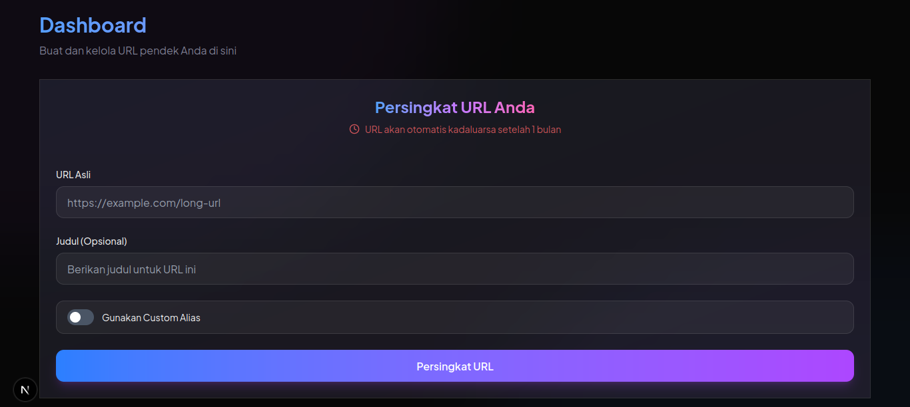

# 🔗 URL Shortener

Aplikasi pemendek URL modern yang dibangun dengan Next.js 14, Supabase, dan TailwindCSS. Dilengkapi dengan fitur autentikasi, pelacakan klik, dan manajemen link yang lengkap.



## ✨ Fitur

- 🔐 **Autentikasi Pengguna**
  - Login dan registrasi dengan email
  - Verifikasi email
  - Proteksi rute dengan middleware
  
- 🎯 **Manajemen URL**
  - Pembuatan URL pendek otomatis
  - Opsi custom alias
  - Pelacakan jumlah klik
  - Pengelolaan URL (hapus, salin)
  - Kadaluarsa otomatis setelah 1 bulan
  
- 🎨 **UI/UX Modern**
  - Desain responsif
  - Animasi halus dengan Framer Motion
  - Tema gelap (dark mode)
  - Loading states & feedback
  - Toast notifications
  
- 🛠 **Fitur Teknis**
  - Server-side rendering dengan Next.js
  - Real-time updates dengan Supabase
  - Optimistic updates
  - Rate limiting
  - Error handling

## 🚀 Teknologi

- [Next.js 14](https://nextjs.org/) - Framework React
- [Supabase](https://supabase.com/) - Backend as a Service
- [TailwindCSS](https://tailwindcss.com/) - Framework CSS
- [BimsUI](https://ui.bimadev.xyz/) - Komponen UI
- [Framer Motion](https://www.framer.com/motion/) - Animasi
- [React Hot Toast](https://react-hot-toast.com/) - Notifikasi

## 📦 Instalasi

1. Clone repository
```bash
git clone https://github.com/bimadevs/next-url-shortener.git
cd next-url-shortener
```

2. Install dependencies
```bash
npm install
```

3. Setup environment variables
```bash
cp .env.example .env.local
```

Isi `.env.local` dengan kredensial Supabase Anda:
```
NEXT_PUBLIC_SUPABASE_URL=your-supabase-url
NEXT_PUBLIC_SUPABASE_ANON_KEY=your-supabase-anon-key
SUPABASE_SERVICE_ROLE_KEY=your-supabase-service-role-key
```

4. Setup database Supabase

Jalankan SQL berikut di SQL Editor Supabase:

```sql
-- Tabel URL
create table public.short_urls (
  id uuid default gen_random_uuid() primary key,
  created_at timestamp with time zone default timezone('utc'::text, now()) not null,
  user_id uuid references auth.users on delete cascade not null,
  original_url text not null,
  short_code text not null unique,
  title text,
  clicks bigint default 0,
  is_custom boolean default false,
  expiration_date timestamp with time zone not null
);

-- RLS Policies
alter table public.short_urls enable row level security;

create policy "URLs are viewable by owner" on public.short_urls
  for select using (auth.uid() = user_id);

create policy "URLs are insertable by owner" on public.short_urls
  for insert with check (auth.uid() = user_id);

create policy "URLs are deletable by owner" on public.short_urls
  for delete using (auth.uid() = user_id);

-- Function untuk membersihkan URL kadaluarsa
create or replace function delete_expired_urls()
returns void
language plpgsql
security definer
as $$
begin
  delete from public.short_urls
  where expiration_date < now();
end;
$$;
```

5. Jalankan development server
```bash
npm run dev
```

Buka [http://localhost:3000](http://localhost:3000) di browser Anda.

## 📝 Penggunaan

1. **Registrasi/Login**
   - Daftar menggunakan email
   - Verifikasi email Anda
   - Login ke dashboard

2. **Membuat URL Pendek**
   - Masukkan URL asli
   - (Opsional) Tambahkan judul
   - (Opsional) Gunakan cutome alias
   - Klik "Persingkat URL"

3. **Mengelola URL**
   - Lihat daftar URL Anda
   - Salin URL pendek
   - Hapus URL yang tidak digunakan
   - Pantau jumlah klik

## 🤝 Kontribusi

Kontribusi selalu diterima! Berikut cara Anda dapat berkontribusi:

1. Fork repository
2. Buat branch fitur (`git checkout -b feature/AmazingFeature`)
3. Commit perubahan (`git commit -m 'Add some AmazingFeature'`)
4. Push ke branch (`git push origin feature/AmazingFeature`)
5. Buat Pull Request

## 📄 Lisensi

Didistribusikan di bawah Lisensi MIT. Lihat `LICENSE` untuk informasi lebih lanjut.

## 👤 Author

**Bima Dev**
- GitHub: [@bimadevs](https://github.com/bimadevs)

## 🙏 Docs

- [Next.js Documentation](https://nextjs.org/docs)
- [Supabase Documentation](https://supabase.com/docs)
- [TailwindCSS Documentation](https://tailwindcss.com/docs)
- [NextUI Documentation](https://nextui.org/docs)

---

⭐️ Jika Anda menyukai project ini, berikan bintang!
